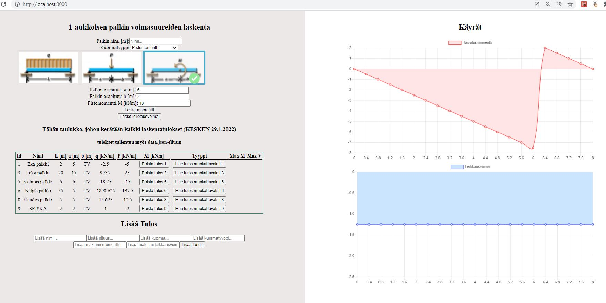
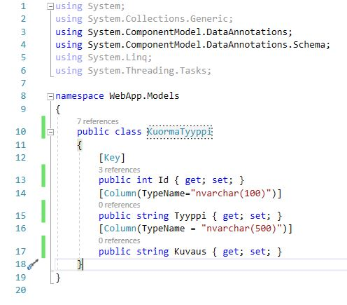
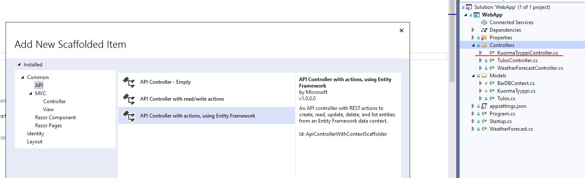
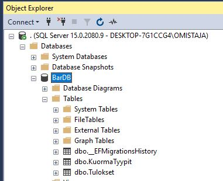

This is the source code for https://youtu.be/c_9c5zkfQ3Y

This is the project from the [YouTube crash course](https://www.youtube.com/watch?v=w7ejDZ8SWv8). 
It includes the react ui as well as JSON-server for our mock backend

## Usage

### Install dependencies

```
npm install
```

### Run React dev server (http://localhost:3000)

```
npm start
```

### Run the JSON server (http://localhost:5000)

```
npm run server
```

### To build for production

```
npm run build
```
## Kuvaus ohjelmasta
Ohjelma laskee 1-aukkoisen palkin taivutusmomentti- ja leikkausvoimakuviot ja 
tallentaa niistä maksimitulokset paikallisesti db.json filuun. 
Jatkossa on myös tarkoitus tehdä tallennus tietokantaan.
### Kuva Layout:sta




## Fullstackohje

https://www.youtube.com/watch?v=gpfP60KjmZU


## Ohje Result-taulukon päivitykseen

https://github.com/machadop1407/multi-step-form-react
https://www.w3schools.com/react/react_usestate.asp 
ohjeessa luotu useState:lla taulukko, jonka arvoja päivitetään eri tiedostojen kautta

## Ohje WebApp backend-sovelluksen tekemiseen
https://www.youtube.com/watch?v=NemyDIUcC64
...jatka kohdasta 1.04
https://github.com/CodAffection/React-CRUD-with-Asp.Net-Core-Web-API

## Backend: KuormaTyyppi-taulun luonti Tietokannan migraation avulla
1. Luo Models-kansioon KuormaTyyppi.cs luokka
   
2. Luo Controller-kansioon KuormaTyyppiController.cs EF:n avulla
   
3. Luo Models-kansioon BarDBContext.cs filuun luotavien tietokannan taulun nimi "KuormaTyypit" 
4. Lisää appsettings.json filuun yhteys tietokantaan "ConnectionStrings"
5. Luo migraatio "Add-Migration "InitialCreate""-käskyllä (Package Manager Console:ssa)
6. Päivitä tietokanta "Update-Database"-käskyllä (Package Manager Console:ssa)
   


